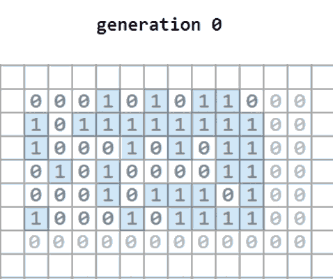

---

  ### Conway's Game of life  




The gif above shows how the program worked -it will only show scope of darker numbers in each generation.
The lighter number in background is just to indicate the empty space it has trimmed. 
    
  * Description:  
    [Wiki](https://en.wikipedia.org/wiki/Conway%27s_Game_of_Life):  
    *The universe of the Game of Life is an infinite, two-dimensional orthogonal grid of square cells, each of which is in one of two possible states, live or dead, (or populated and unpopulated, respectively). Every cell interacts with its eight neighbours, which are the cells that are horizontally, vertically, or diagonally adjacent.*
    
    This program is design to calculate the state after few generations by giving the primary state. Consider the *infinite space*, instead of showing fixed scope that contains empty rows/ cols or not includes all live cells, the program is able to show all live cells in the minimum scope.
    
  * Concept:  
    Unlike 2-D array made of built-in list, numpy array is more flexible to be reshaped or copied. Furthermore, setting dtype = int8 could even achieve a better memory optimization.
    Inorder to identify the current state of a cell, the initional value of *next_cells* is 1 for live cells, -1 for dead ones. If a live cell is found, the *next_cells* value of its neighbors would be multified by 2. Thus, we will know whether the cell will live in next generation by checking whether its value is in (4, 8, -8). (live if a live cell has 2/3 live neighbors or a dead cell has 3 live neighbors)
    
  * libs:   
    Numpy (3rd-party): To speed up some operations. Also for generating the primary state to test the program.
  * Preview: (edit the layout for less space used)
    ```
      >> cells = numpy.random.randint(2, size=(3, 5))
      >> get_generation(cells, 5)
      
      generation0      generation1      generation2
       [[1 1 1 0 1]     [[0 1 0 0]]      [[1 1 0 0]
       [0 1 0 1 0]       [1 1 1 1]        [1 1 0 1]
       [0 1 1 0 0]]      [0 0 0 1]        [1 0 0 1]
                         [0 1 1 0]]       [0 0 1 0]]

      generation3      generation4      generation5
       [[0 1 1 1 0]     [[0 0 1 0]       [[1 1 0]
       [1 0 0 0 0]       [0 1 1 0]        [1 1 1]
       [0 1 0 0 1]]      [1 0 0 1]]       [1 1 0]]    
     ```
