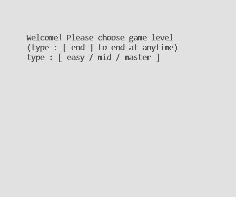
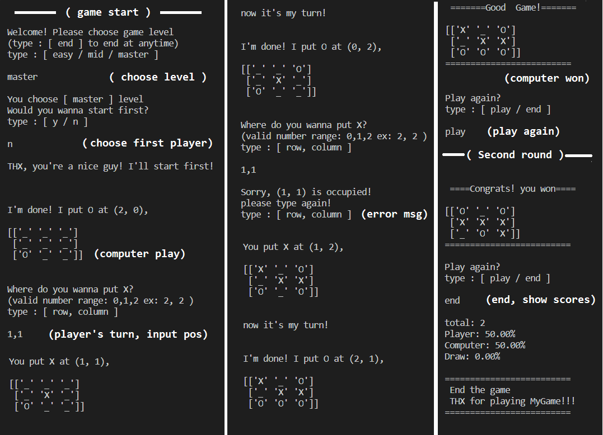

  ### Tic-tac-toe Game
  
  
  
  * Description:
    An interactive game that the player can challenge the computer with 3 levels: easy, mid and master,
    also available to choose who plays first and end the game at any time.
    It would automatically compute who wins the game this time and restart the game if the player wants to play again.
    Once the player ends it, a statistic of how many games the player has won/ lose/ draw would show up on the screen. 
    This could be used in further data analysis.
  * Concept:
    By setting player = 2, computer = 3 and empty = 1, it could be very useful to check if someone is about to get 3 in a row
    and decide where to put.
  * libs:   
    Numpy (3rd-party):  Speed up and calculate complex algorithm.   
    Random (Built-in):  Increase unpredictable moves in easy level and some of mid & master level.   
    time (Built-in): Produce asynchronous outputs for better experience.   
  * Preview:
     
