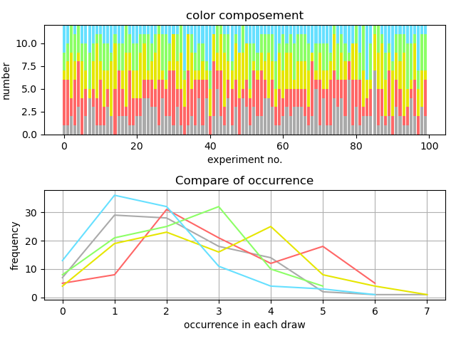

### possibility calculator


* Purpose: 
The program consists of two modes.
In Hat mode, you'll put balls with 5 different amounts and colors, and it will calculate the possibility of occurrence of specific combination (draw without replacement).
In Dice mode, it'd calculate the possibility of the sum of points equals x when rolling n dices(m-sides) in each time. Both will print a statistical chart.
You can set seed to initialize the random generator for reproducibility (optional).

* Concepts: 
In calculations, instead of a list of randomly arranged picked colors/ points, it uses a fixed-length list which indicates the count of each color/point to minimize memory used.
In Hat mode, the balls shouldn't go back into the hat during the draw. Therefore, the count of content changes as picking, leading to change of possibility of each color being picked in next time.
The Dice mode, on the other hand, is independent - every dice has no impact on the others. As a result, the algorithm is much simpler and we only need one-pass calculation to get the data.

* Libs: Numpy(random), Pandas,  Matplotlib(pyplot,  GridSpec, MultipleLocator)

* Preview:   
**example of hat**

*with seed*   


*without seed*   

```
>> exp = Experiment() # experiment instance

>> hat = Hat([35, 51, 43, 38, 27], 1235) # white/red/yellow/green/blue, seed
>> hat_r = Hat([35, 51, 43, 38, 27]) # without seed

>> expect = [0,3,2,0,0] # expected balls: 3 red balls + 2 yellow balls

>> exp.hat_experiment(self.hat, 12, 100, expect) # take 12 balls in each draw, 100 experiments
0.56
>> exp.hat_experiment(self.hat_r, 12, 100, expect) # same condition, but no seed
0.42
```
**example of dice**

*with seed*   

   
*without seed*   


```
>> dice = Dice(6, 456) # 6 sides with seed
>> dice_r = Dice(6) # without seed
        
#### rolling 3 dice in each experiment, 100 experiments, expect sum of point = 10
>> exp.dice_experiment(self.dice, 3, 100, 10) # with seed
0.12
>> exp.dice_experiment(self.dice_r, 3, 100, 10) # without seed
0.15
```
*with seed compared to ideal distribution (data from another project: [sum_of_dice](https://github.com/Ellie-Yen/demo_project/tree/master/Math/sum_of_dices))*


